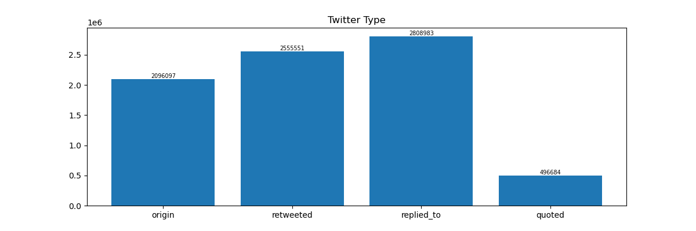

# ADHD Project

## Data Description

+ Total Users: 2963


+ Total User Tweets: 7957315


+ Tweets Length: 1-236
  


+ Time Period: 2009-04-28 19:13:58+00:00 -- 2022-03-19 06:06:10+00:00

  


+ Tweet Type
  origin: 2096097 retweeted: 2555551 replies: 2808983 quoted: 496684
  


+ Data Example

  ```Json
  {
        "tweet_id": 1504350757109186564,
        "text": "RT @genderoftheday: The gender today is a lucky monkey with a crystal ball.",
        "created_at": "2022-03-17 06:55:44+00:00",
        "public_metrics": {
            "retweet_count": 7,
            "reply_count": 0,
            "like_count": 0,
            "quote_count": 0
        },
        "in_reply_to_user_id": null,
        "referenced_tweets": {
            "id": 1504349575477436422,
            "type": "retweeted"
        }
    }
  ```
          "_comment": if referenced_tweets is [], it means the tweet is original post