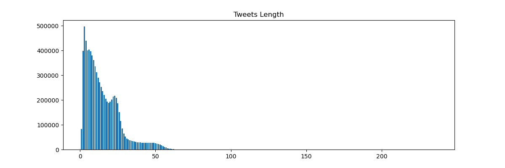
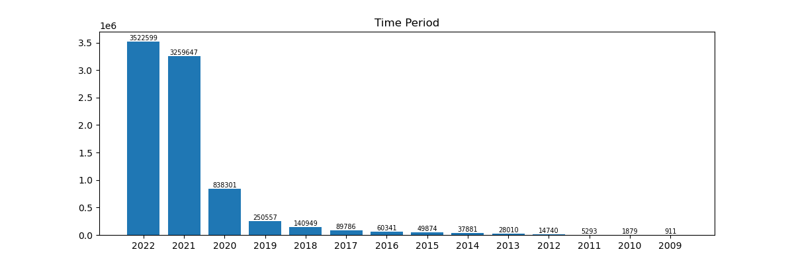
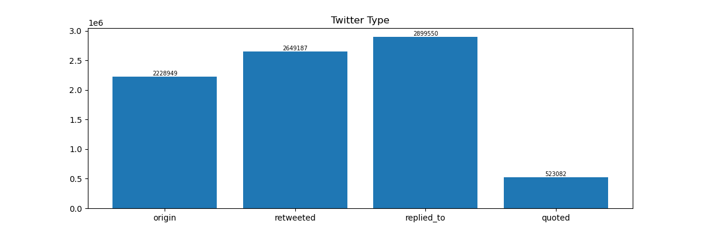
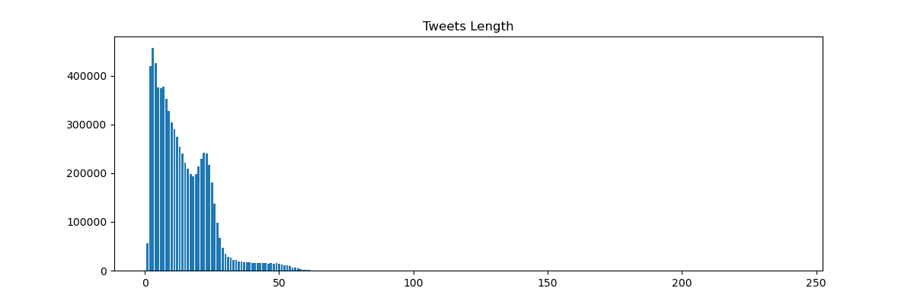
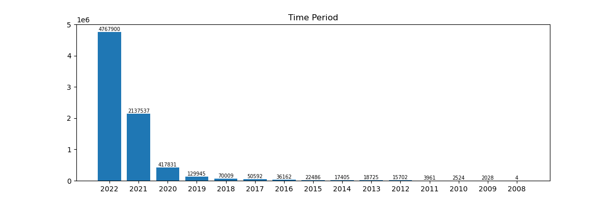
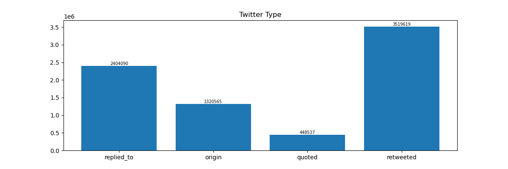

# ADHD Project

## Data Description

### ADHD group users

+ Total Users: 3135


+ Total User Tweets: 8300768


+ Tweets Length: 1-236
  


+ Time Period: 2009-04-28 19:13:58+00:00 -- 2022-03-24 08:38:01+00:00

  


+ Tweet Type
  2228949 retweeted: 2649187 replies: 2899550 quoted: 523082
  


+ Data Example

  ```Json
  {
        "tweet_id": 1504350757109186564,
        "text": "RT @genderoftheday: The gender today is a lucky monkey with a crystal ball.",
        "created_at": "2022-03-17 06:55:44+00:00",
        "public_metrics": {
            "retweet_count": 7,
            "reply_count": 0,
            "like_count": 0,
            "quote_count": 0
        },
        "in_reply_to_user_id": null,
        "referenced_tweets": {
            "id": 1504349575477436422,
            "type": "retweeted"
        }
    }
  ```
          "_comment": if referenced_tweets is [], it means the tweet is original post


### Neurotypical group users

+ Total Users: 3223


+ Total User Tweets: 7692811


+ Tweets Length: 1 -- 240
  


+ Time Period: 2008-12-06 08:27:14+00:00 -- 2022-03-25 15:23:18+00:00

  


+ Tweet Type
  origin: 1320565 retweeted: 3519619 replies: 2404090 quoted: 448537
  